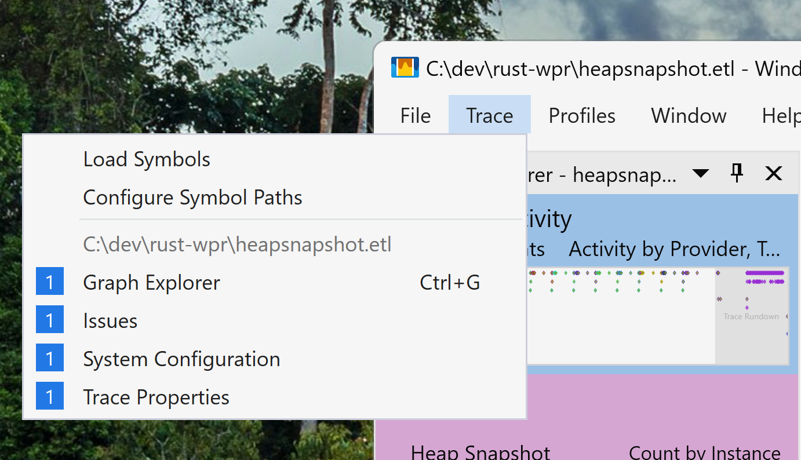
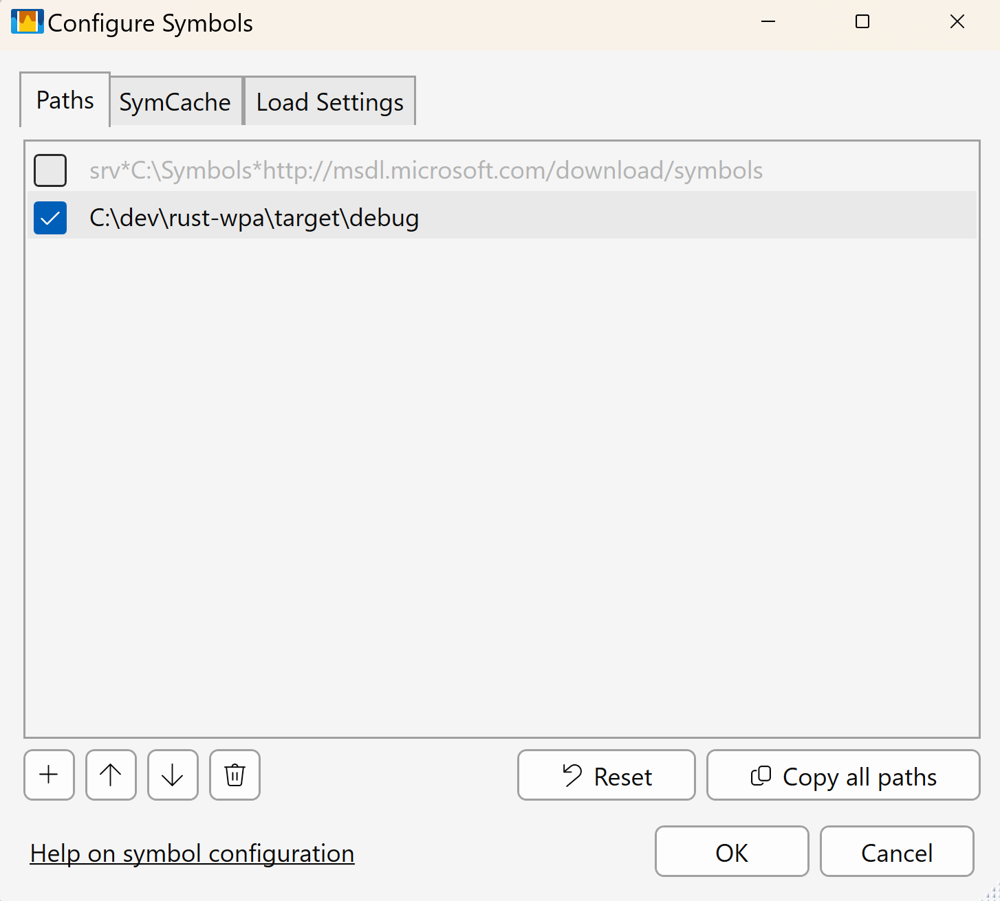
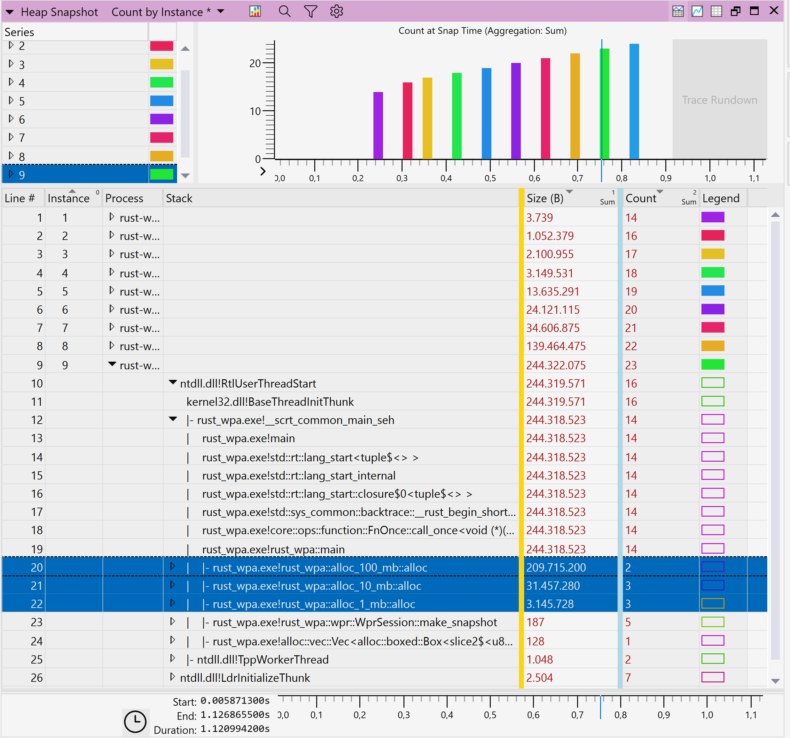

# Profiling Heap Allocations in Rust on Windows

This project demonstrates the process of profiling heap allocations in a Rust application on Windows using the Windows Performance Toolkit. It performs heap allocations of different sizes and uses `wpr` to capture these allocations.

Heap profiling requires running `wpr` with administrative privileges. Because the application runs `wpr` directly, it must be run with administrative privileges too.

## Prerequisites

- The latest available version of [Windows Performance Toolkit](https://learn.microsoft.com/en-us/windows-hardware/get-started/adk-install).

## Example

```powershell
git clone --depth 1 https://github.com/Vaiz/rust-wpr.git
cd rust-wpr
# For demonstrative purposes, it's better to build a debug version of the application
cargo run heapsnapshot.etl
wpa heapsnapshot.etl 
```

## Analyzing the .etl File

1. Open the `.etl` file in Windows Performance Analyzer (WPA).
2. Add the path to debug symbols:
    - Go to `Trace -> Configure Symbols Path -> Add Entry`.
    -  
3. Load symbols:
    - Go to `Trace -> Load Symbols`.
4. Dive into captured stacks:
    - Navigate to `Graph Explorer -> Memory -> Heap Snapshot`.
    - 

In the `Analysis` window, you will see all snapshots created by wpr. You can expand each snapshot to see all recorded allocations that were not freed at the moment of snapshot creation. It shows the stack where the allocation happened, the number of allocations, and the size.
